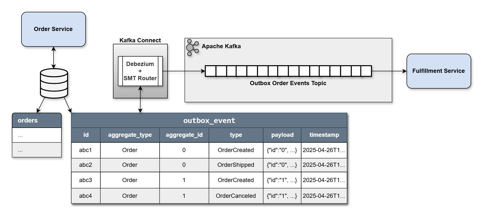

# Outbox Pattern


This repository if part of an introductory blog post on dev.to for how to use the Outbox Pattern to create a reliable event-driven architecture. The focus is on using PostgreSQL and Strimzi to store data and emit events in a transactional way using a Spring Boot microservice, but these concepts can be applied to other configurations.



[](https://www.buymeacoffee.com/stevenjdh)

## Features

* Code examples that work identically with different architectures.
* Support for storing event payloads in PostgreSQL JSONB fields.
* Support for OpenTelemetry.
* Full infrastructure creation for both local and Kubernetes testing.
* Events are dynamically routed to different outbox topics because on aggregate type.

## Contents

* [Local](./local): Uses docker compose to setup a backend for testing the Outbox Pattern.
* [Kubernetes](./kubernetes): Similar to the above, but implements a more real-world setup on Kubernetes.
* [Debezium](./debezium): Shows how to optionally create a custom image with the debezium-connector-postgres plugin.
* [Examples](./_examples): A collection of code examples using the Outbox Pattern.

## Usage (local)

### Makefile approach

```bash
make start [app=quarkus]
make logs [name=<kafka|postgres|debezium|debezium-configurer|schemaregistry|akhq|kafka-ui|zipkin|otel-collector|outbox-pattern>]
make stop # Or 'make clean' to stop and remove image cache used.
```

### Docker Compose approach

```bash
docker-compose up -d
docker-compose logs [kafka|postgres|debezium|debezium-configurer|kafka-ui|zipkin|otel-collector|outbox-pattern]
mvn spring-boot:run -f ....
docker-compose down --volumes --remove-orphans --timeout 20
```

### Cleanup idle DB connections

When an IDE doesn't support stopping a running application with a graceful shutdown (e.g., SIGINT or SIGTERM), but instead forces a shutdown (e.g., SIGKILL), then the default 10 idle pool connections will be left opened. Eventually, the default 100 connection limit PostgreSQL has will be hit. If you don't want to reset the server, then the follow commands will be useful to clean up the connections.

Show connection limit:

```sql
SHOW max_connections;
```

List current connections:

```sql
SELECT pid, usename, application_name, client_addr, backend_start, state
FROM pg_stat_activity
WHERE datname = current_database() AND state = 'idle';
```

Terminate idle connections:

```sql
SELECT pg_terminate_backend(pid)
FROM pg_stat_activity
WHERE datname = current_database() AND state = 'idle';
```

Alternatively, just run the application from a terminal to avoid the need for all of this, since `Ctrl+C` sends a SIGTERM for graceful shutdown. 

## Contributing
Thanks for your interest in contributing! There are many ways to contribute to this project. Get started [here](https://github.com/StevenJDH/.github/blob/main/docs/CONTRIBUTING.md).

## Do you have any questions?
Many commonly asked questions are answered in the FAQ:
[https://github.com/StevenJDH/outbox-pattern/wiki/FAQ](https://github.com/StevenJDH/outbox-pattern/wiki/FAQ)

## Want to show your support?

|Method          | Address                                                                                   |
|---------------:|:------------------------------------------------------------------------------------------|
|PayPal:         | [https://www.paypal.me/stevenjdh](https://www.paypal.me/stevenjdh "Steven's Paypal Page") |
|Cryptocurrency: | [Supported options](https://github.com/StevenJDH/StevenJDH/wiki/Donate-Cryptocurrency)    |


// Steven Jenkins De Haro ("StevenJDH" on GitHub)
